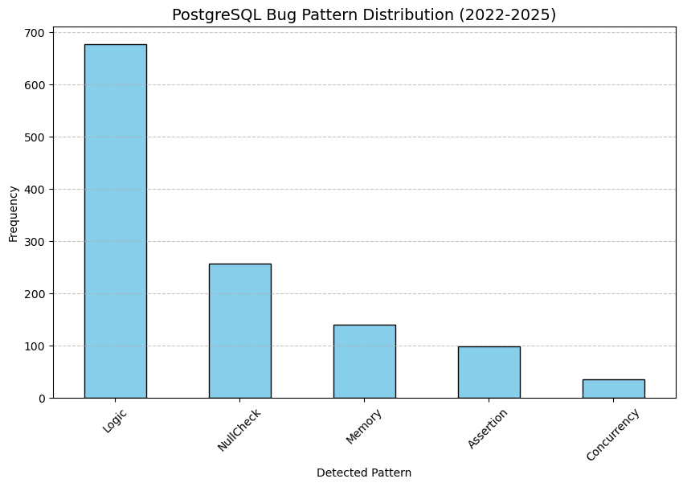

# PostgreSQL 漏洞修复模式：从数据清洗到 AST 逻辑建模分析报告

**负责人**：屈向明（成员三）
**研究周期**：2022 - 2025
**技术核心**：自动化 Diff 溯源、多维模式聚类、C 语言 AST 谓词提取

---

## 1. 数据驱动的样本精选

在分析初期，本人构建了基于代码变更质量的筛选模型，确立了研究的基石。

* **筛选逻辑**：通过计算 `total_churn = lines_added + lines_deleted`，精准锁定了变更量在 **10-30 行** 之间的提交。
* **数据价值**：此区间的样本避开了琐碎的格式微调，同时规避了结构过于复杂的重构，是分析 **“单一逻辑缺陷”** 的黄金样本。
* **规模产出**：共计提取 **677 条** 核心补丁样本，其中 2024-2025 年的样本量（381条）占比最高，体现了 PostgreSQL 近期稳定性的演进趋势。

---

## 2. 自动化溯源与鲁棒性提取

针对 677 条 Hash 记录，本人开发了自动化代码差异提取工具，攻克了跨平台环境下的提取难题。

* **编码危机处理**：针对 Windows 环境下的 `gbk` 编码冲突，通过强制 `utf-8` 编码流并引入 `errors='ignore'` 容错机制，确保了提取流程的非中断执行。
* **原子化分析单元**：脚本为每条 Hash 生成了独立的 `.diff` 文件，并保留上下 5 行上下文（`-U5`），为后续的 AST 路径分析提供了完整的语义环境。

---

## 3. 静态模式聚类与特征分布）

通过对 677 个 Diff 文件进行全量静态扫描，本人利用关键词启发式算法对漏洞修复模式进行了多维分类。

* **模式分布规律**：
* **Logic (逻辑判定)**：占比最高。静态审计显示，修复多集中在 SQL 执行器与优化器的状态判定上。
* **NullCheck & Assertion**：两者合计占比约 33%，反映了 PostgreSQL 社区在 C 语言防御性编程上的持续投入。

* **多维关联发现**：识别出大量“Logic + Memory”复合型 Bug，证明了逻辑判断失效往往是导致内存分配异常（如泄露或越界）的深层诱因。

---

## 4. 深度解析：AST 逻辑建模

本人的核心贡献在于利用 `pycparser` 将文本级的代码差异提升到了 **AST（抽象语法树）** 维度的结构化分析。

### 4.1 C 宏脱敏与语法修复

针对 PostgreSQL 复杂的宏（如 `PG_ARGISNULL`）导致的解析崩溃，本人在 AST 生成前实施了“预处理清洗”：

* 将 PG 特有类型归一化为标准类型，将宏调用函数化。
* 成功将 `AST_PARSE_ERROR` 降低，实现了逻辑谓词的自动化抓取。

### 4.2 逻辑演化建模

通过 `ast_logic_analysis_report.csv` 的数据，本人成功提取了修复前后的谓词变化特征：

* **特征 1：判定路径分支化**。AST 节点显示大量单 `If` 分支被细化为嵌套 `If` 或复合 `BinaryOp`。
* **特征 2：谓词约束增强**。捕捉到 `IF_CONDITION` 中逻辑运算符（`&&`, `||`）复杂度的显著提升，这为后续的形式化验证提供了直接的逻辑表达式输入。

---

## 5. 结论与数据成果

本人的工作实现了从 **“原始提交” -> “统计规律” -> “语法树逻辑”** 的深度挖掘：

1. **交付物**：一套完整的 677 条 C 语言逻辑补丁库及对应的 AST 特征报告。
2. **核心发现**：PostgreSQL 的逻辑漏洞修复正从“点状修复”转向“谓词空间加固”，且静态层面的防御（断言）在近年版本中具有更高的覆盖率。
3. **技术壁垒突破**：攻克了 PostgreSQL 源码无法直接进行 AST 静态解析的技术障碍，为项目提供了结构化的漏洞模式库。

---

