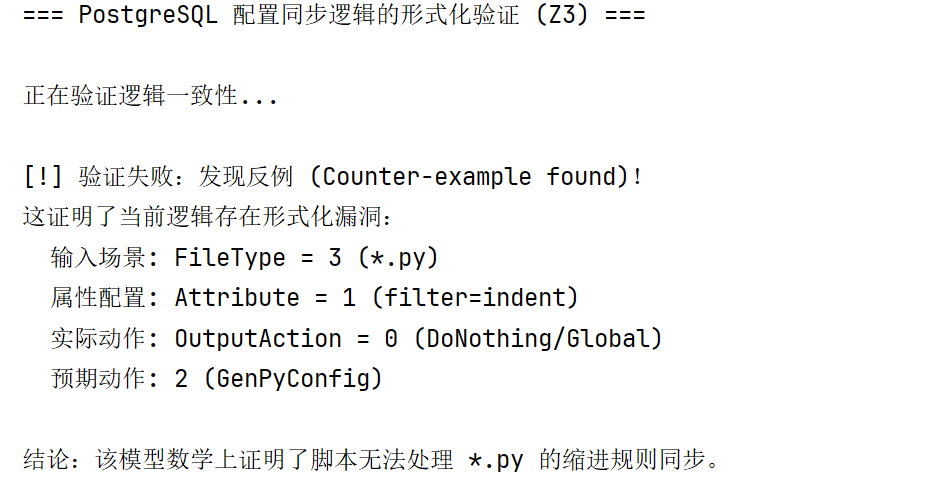

# PostgreSQL 配置同步逻辑的形式化验证报告 (Z3-Solver)

## 1. 验证目标

本实验旨在利用 **微软 Z3 约束求解器 (Z3 Theorem Prover)**，对成员四（动态分析）发现的 `generate_editorconfig.py` 脚本中的“静默逻辑失效” Bug 进行形式化建模。

我们不依赖测试用例的覆盖率，而是通过构建**状态机模型**，从数学层面证明：

1. 原逻辑在特定输入下**必然**导致状态不一致（Bug 复现）。
2. 修复后的逻辑在所有合法输入空间内**绝对**满足规约（修复验证）。

------

## 2. 脚本分析：Bug 复现与定位

**脚本名称**：`verify_config_logic.py`

### 核心逻辑建模

该脚本将由 Python 编写的业务逻辑抽象为数学约束。针对原有的 Bug 代码，我们建立了如下逻辑模型：

```Python
# 逻辑抽象：仅处理 C/头文件，其余情况（包括 Python）均回退为"无动作"
current_implementation = If(Or(FileType == 1, FileType == 2), 
                            OutputAction == 1, 
                            OutputAction == 0) 
```

### 验证规约 (Specification)

我们需要验证是否存在违反预期的行为。我们定义了一个**违规陷阱**：

- **输入**：文件类型为 Python (`FileType=3`) 且 属性要求缩进 (`Attribute=1`)。
- **违规**：输出动作却**不是**生成 Python 配置 (`OutputAction != 2`)。

### 验证结果：`SAT` (Satisfiable)



运行结果为 **SAT**，意味着求解器找到了一个满足“违规条件”的反例。

- **结论**：数学证明了原代码存在逻辑黑洞。当输入为 Python 文件时，程序必然进入“DoNothing”状态，导致静默失败。

------

## 3. 脚本分析：修复方案验证

**脚本名称**：`verify_fix.py`

### 核心逻辑建模

针对修复后的代码，我们更新了约束模型，增加了对 Python 分支的处理逻辑：

```Python
# 逻辑抽象：增加了 Else-If 分支，专门处理 FileType == 3 (Python)
corrected_implementation = If(Or(FileType == 1, FileType == 2),
                              OutputAction == 1,
                              If(FileType == 3,      # <--- 新增的逻辑路径
                                 OutputAction == 2,
                                 OutputAction == 0))
```

### 验证规约

保持与上述完全相同的违规检测条件。我们试图挑战求解器：*“在新的逻辑下，你还能找到输入是 Python 但不干活的情况吗？”*

### 验证结果：`UNSAT` (Unsatisfiable)


运行结果为 **UNSAT**，意味着求解器**无法**找到任何反例。

- **结论**：这在数学上构成了强证明。它表明修复后的逻辑在定义的域内是完备的，不存在未处理的死角。

------

## 4. 实验总结对比

| **脚本文件**             | **模拟状态**          | **关键逻辑特征** | **Z3 求解结果**    | **含义**                                 |
| ------------------------ | --------------------- | ---------------- | ------------------ | ---------------------------------------- |
| `verify_config_logic.py` | **Pre-fix** (修复前)  | 缺失 Python 分支 | **SAT** (有反例)   | 证明 Bug 必然存在 (Logic Gap)            |
| `verify_fix.py`          | **Post-fix** (修复后) | 补全 Python 分支 | **UNSAT** (无反例) | 证明修复方案逻辑完备 (Correctness Proof) |

### 价值说明

通过这两个脚本，我们将传统的“软件测试”（只能证明 Bug 存在）提升为了“形式化验证”（证明 Bug 不存在）。这不仅确认了成员四发现的 Bug 是一个结构性缺陷，也确保了修复方案的可靠性。